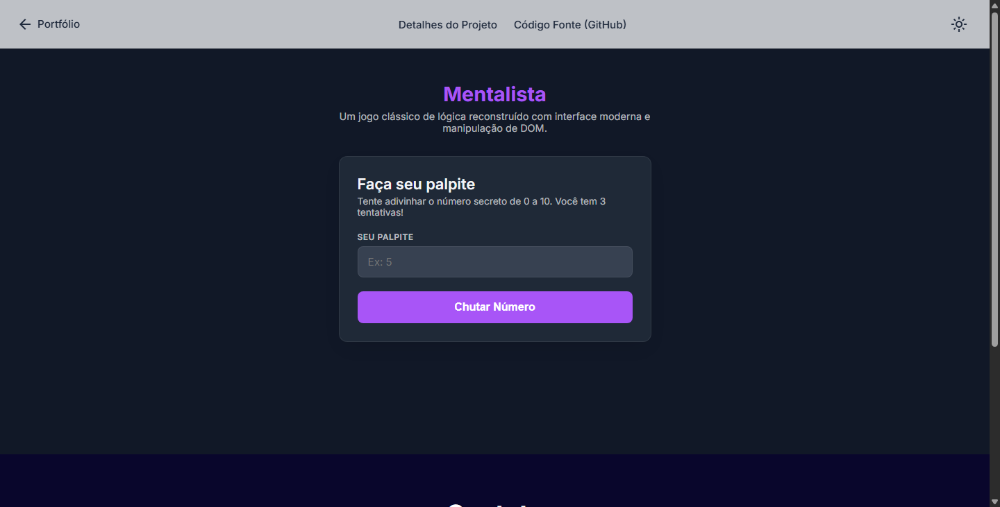

# 🔮 Mentalista

Um jogo clássico de adivinhação lógica onde o usuário tem o desafio de descobrir um número secreto sorteado pela máquina.

Este projeto nasceu inspirado em um exercício básico da Imersão Dev da Alura, mas foi **completamente reconstruído do zero**. A versão original, que dependia de caixas de diálogo nativas do navegador (`prompt` e `alert`), foi descartada em favor de uma manipulação avançada de DOM, validações de input em tempo real e uma interface gráfica moderna e responsiva.

---

## ✨ Funcionalidades

### 🎮 Dinâmica do Jogo
* **Sorteio Aleatório:** Utilização da biblioteca nativa `Math` do JavaScript para gerar números inteiros imprevisíveis entre 0 e 10 a cada nova rodada.
* **Sistema de Tentativas:** O jogador possui exatamente 3 chances para acertar. A cada erro, o sistema fornece dicas contextuais matemáticas (informando se o número secreto é *maior* ou *menor* que o palpite atual).
* **Reset Dinâmico:** Ao finalizar a partida (seja por vitória ou derrota), os controles são bloqueados e um botão de "Jogar Novamente" surge dinamicamente na interface para reiniciar o ciclo sem precisar recarregar a página.

### ⌨️ UX de Input e Validação
* **Suporte Integral ao Teclado:** Captura de eventos físicos (`keypress`), permitindo que o usuário envie seu palpite rapidamente apenas pressionando a tecla `Enter`.
* **Auto-Focus e Limpeza:** O campo de digitação é limpo e recebe o foco automático após cada palpite, garantindo um fluxo contínuo de jogo sem a necessidade de cliques extras.
* **Validação de Dados:** Bloqueio inteligente contra inputs vazios, letras ou números fora do escopo permitido (menores que 0 ou maiores que 10), retornando avisos amigáveis sem consumir as tentativas do jogador.

### 🎨 Design System & UI/UX
* **Vanilla HTML/CSS/JS:** Construído sem frameworks, demonstrando domínio das tecnologias base da web.
* **Feedback Visual Dinâmico:** O painel de mensagens altera suas cores e classes CSS baseando-se no estado da ação (Verde para sucesso, Vermelho para erro/derrota, Amarelo para dicas/avisos).
* **Modo Claro / Escuro:** Toggle de tema persistente (salvo no `localStorage`), utilizando variáveis globais CSS (`:root`) para transições de cores em toda a aplicação.
* **Interface Responsiva:** Header com *Glassmorphism* (efeito de vidro) escuro por padrão, Painel em formato de Card centralizado e Menu Hambúrguer interativo para telas mobile.

---

## 🚀 Tecnologias Utilizadas

* **HTML5:** Estrutura semântica e atributos de acessibilidade (`inputmode="numeric"`, `aria-labels`).
* **CSS3:** Variáveis CSS nativas, Flexbox, Media Queries, Sombras dinâmicas e Transições suaves de estado.
* **JavaScript (ES6+):** Delegação e escuta de Eventos (`addEventListener`), manipulação direta do DOM (`classList`, `textContent`), `Math.random()`, `localStorage` e lógica condicional.
* **APIs Visuais:**
  * Google Fonts (Inter, Roboto Mono)
  * Material Symbols (Ícones do Google)

---

## ⚙️ Como rodar o projeto localmente

Como o projeto utiliza apenas tecnologias nativas do navegador, não é necessário instalar dependências (como `npm` ou `yarn`).

1. Faça o clone deste repositório: `git clone https://github.com/GitAkzo/Mentalista.git`

2. Acesse a pasta do projeto: `cd Mentalista`

3. Abra o arquivo `index.html` diretamente no seu navegador de preferência, ou utilize a extensão Live Server do VS Code para emular um servidor local.

---

### 💡 Não quer baixar o código?
Sem problemas! Você pode testar a aplicação agora mesmo direto no seu navegador:

Para mais detalhes, acesse a página do projeto no meu portfólio:

---

## 👨‍💻 Autor

**Paulo Rasec** | Engenheiro de Software | Desenvolvedor Web | Pós-graduando em Direito Digital e LGPD

---

## 📝 Licença

Este projeto está sob a licença MIT.
